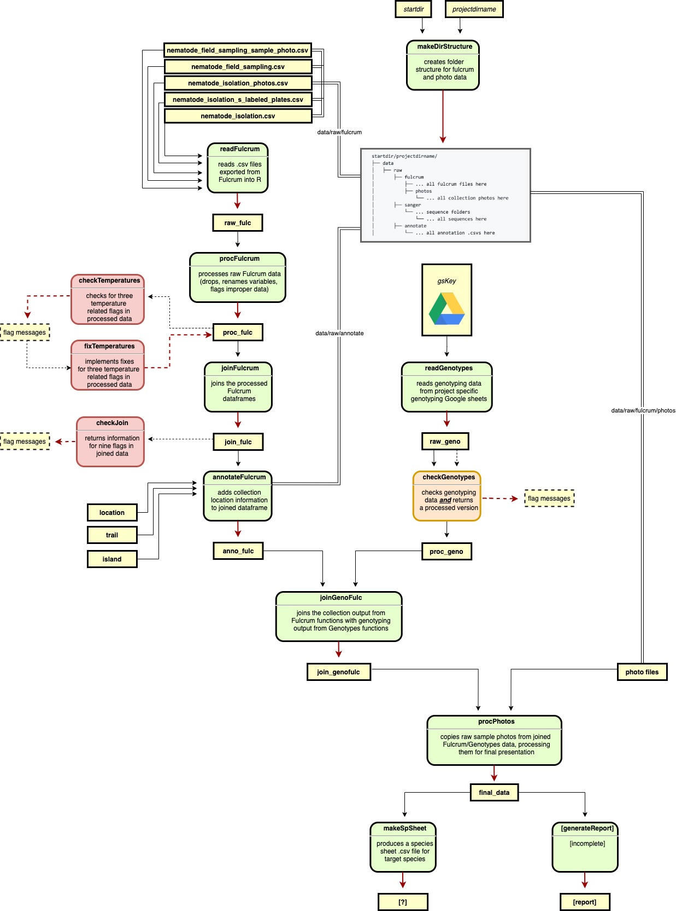

# easyfulcrum

The `easyfulcrum` package is a tool to work with data from Fulcrum exports, genotyping Google sheets, blast results, and images from collection. 

## Installation

The package is made for specific use with Fulcrum generated collection data. `easyfulcrum` is specialized for use in the Andersen Lab and, therefore, is not available from CRAN. To install easyfulcrum you will need the [`devtools`](https://github.com/hadley/devtools) package. You can install `devtools` and `easyfulcrum` using the commands below:

```r
install.packages("devtools")
devtools::install_github("AndersenLab/easyfulcrum")
```
The functionality of the package can be broken down into three main goals:

+ Reading raw data from Fulcrum exports, genotyping Google sheets, blast results, and images from collection.

+ Joining these data, flagging anomalies, and allowing the user to correct anomalies.

+ Exporting corrected data and generating summary reports.

## Directory structure

Every collection project should be contained in its own repository. The repository name should follow the `YearMonthPlace` format used for Fulcrum collection projects, e.g. `2020JanuaryHawaii`. Given the complexity of the directory creation, we have created a function `mkDirStructure` that takes two inputs to create an empty substructure for the user to populate, eg:<br>

```{r}
makeDirStructure(startdir = "~/Desktop/", projectdirname = "2020JanuaryHawaii")
```

The directory structure within the repository is critically important for `easyfulcrum` functions.<br>

The `data` directory contains the  `raw` and `processed` subdirectories.<br>
    - `raw/fulcrum` holds the `.csv` files exported from Fulcrum and `raw/fulcrum/photos` contains `.jpg` files exported from Fulcrum.<br>
    - `raw/sanger` can hold `.ab1`, `.phd.1`, `.scf`, and `.seq` files exported from the sequencing facility. We have not implemented functionalities for merging sanger files but will work towards this for the next release.<br>
    - `raw/annotate` can hold spatial location files `island.csv`, `location.csv`, and `trail.csv` that the user generates for mapping the site of collection.<br>
    - `processed/fulcrum` and `processed/sanger` directories hold `easyfulcrum` function outputs.<br>
The `reports` directory holds `easyfulcrum` function outputs. These outputs will be generated by the user processing script(s) saved in the `scripts` directory.<br>

```
2020JanuaryHawaii/
├── data
│   ├── raw
│       ├── fulcrum
│           ├── nematode_field_sampling.csv
│           ├── nematode_field_sampling_sample_photo.csv
│           ├── nematode_isolation.csv
│           ├── nematode_isolation_s_labeled_plates.csv
│           ├── nematode_isolation_photos.csv
│           ├── photos
│               ├── 0a7a5879-8453-4f20-ab3b-8eabb725d492.jpg
│               ├── 0b16d8c7-3cb3-44a8-8b61-e0789e4062c2.jpg
│               └── ... all collection photos here
│       ├── sanger
│           ├── email@northwestern.edu_01_SEQ1677048A_122319D
│               ├── S-10206_oECA306_A01.ab1
│               ├── S-10206_oECA306_A01.phd.1
│               ├── S-10206_oECA306_A01.scf
│               ├── S-10206_oECA306_A01.seq
│               └── ... more sequences here if present
│           └── ... more sequence folders here if present
│       ├── annotate
│           ├── island.csv
│           ├── location.csv
│           └── trails.csv
│   ├── processed
│       ├── fulcrum
│           ├── empty
│       ├── genotypes
│           ├── empty
│       ├── sanger
│           ├── empty
├── reports
│   ├── empty
├── scripts
│   ├── empty
```

This directory exhibits the minimal file content and naming for all the `easyfulcrum` functions to work. The file names in the `photos` directory should not be altered from the Fulcrum export, the names shown here are examples only. The `data/raw/sanger` and `data/processed/sanger` directories are optional. In order to use `easyfulcrum` blast analysis functions the `data/raw/sanger` directory must contain `.seq` and `.ab1` files exported from the sequencing facility, and the use must develop their own functionalities for integrating this. The file names must contain the S-label and primer used. The folders containing the raw sequence data are optional, they are included in this example because this is the way the data are often exported from the sequencing facility. The `data/processed/fulcrum`, `data/processed/sanger`, and `reports` directories are used to hold `easyfulcrum` function outputs. The `scripts` folder will hold some collection processing script(s).

## Project workflow

Nematode collections are performed following a detailed protocol [found here.]( https://docs.google.com/document/d/1jssQVPFrFsXJiA6Jt7LyEjQRBGfcfGCitP4qPya7VwU/edit) The `easyfulcrum` package is written to process and analyze the data generated for a specific collection project.<br>

The basic workflow is to generate a final processed dataframe that can be used for downstream analysis. This occurs in three major processes, as outlined below:<br>


A detailed description of the 14 `easyfulcrum` functions is contained in an example walkthrough of the package functionalities, see the vignette for details:<br>

```{r}
library(easyfulcrum)
browseVignettes(package = "easyfulcrum")
```

A more complete map of the 14 functions is also shown below:<br>


