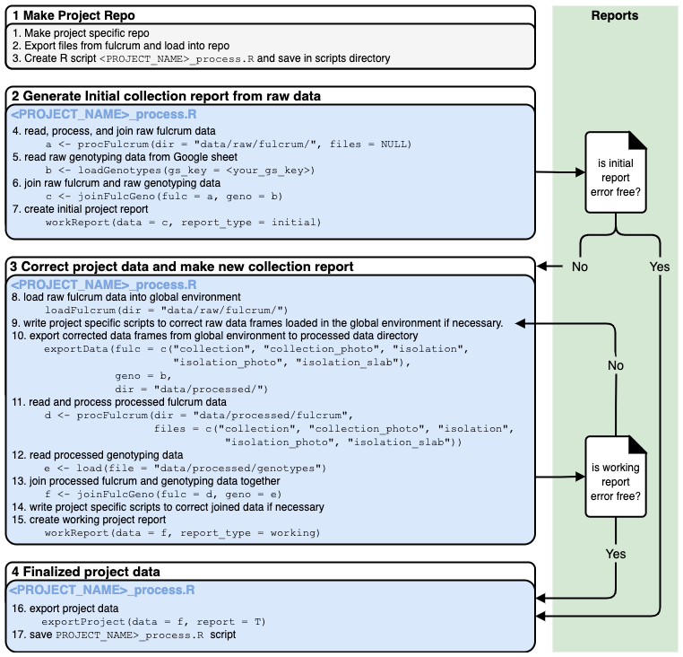

# easyfulcrum

easyfulcrum is specialized for use in the Andersen Lab and, therefore, is not available from CRAN. 

To install easyfulcrum you will need the [`devtools`](https://github.com/hadley/devtools) package. You can install `devtools` and `easyfulcrum` using the commands below:

```r
install.packages("devtools")
devtools::install_github("AndersenLab/easyfulcrum")
```

The functionality of the package can be broken down into three main goals:

+ Reading raw data from Fulcrum exports, genotyping Google sheets, and blast results.

+ Joining these data, flagging anomalies, and correcting anomalies

+ Exporting corrected data and reporting trends

## Directory structure

Every collection project should be contained in its own repository. The repository name should follow the `YearMonthPlace` format used for Fulcrum collection projects, e.g. `2020FebruaryAustralia`.

The directory structure within the repository is critically important for
`easyfulcrum` functions.
The `data` directory contains the  `raw` and `processed` subdirectories.<br>
    - `raw/fulcrum` holds the `.csv` files exported from Fulcrum and `raw/fulcrum/photos` contains `.jpg` files exported from Fulcrum.<br>
    - `raw/sanger` holds the `.ab1`, `.phd.1`, `.scf`, and `.seq` files exported from the sequencing facility.<br>
    - `processed/fulcrum` and `processed/sanger` directories hold `easyfulcrum` function outputs.<br>
The `plots` and `reports` directories hold `easyfulcrum` function outputs. These outputs will be generated by the user processing script(s)
saved in the `scripts` directory.

```
2020FebruaryAustralia/
├── data
│   ├── raw
│       ├── fulcrum
│           ├── nematode_field_sampling.csv
│           ├── nematode_field_sampling_sample_photo.csv
│           ├── nematode_isolation.csv
│           ├── nematode_isolation_s_labeled_plates.csv
│           ├── nematode_isolation_photos.csv
│           ├── photos
│               ├── 0a7a5879-8453-4f20-ab3b-8eabb725d492.jpg
│               ├── 0b16d8c7-3cb3-44a8-8b61-e0789e4062c2.jpg
│               └── ... all collection photos here
│       ├── sanger
│           ├── email@northwestern.edu_01_SEQ1677048A_122319D
│               ├── S-10206_oECA306_A01.ab1
│               ├── S-10206_oECA306_A01.phd.1
│               ├── S-10206_oECA306_A01.scf
│               ├── S-10206_oECA306_A01.seq
│               └── ... more sequences here if present
│           └── ... more sequence folders here if present
│   ├── processed
│       ├── fulcrum
│           ├── empty
│       ├── genotypes
│           ├── empty
│       ├── sanger
│           ├── empty
├── plots
│   ├── empty
├── reports
│   ├── empty
├── scripts
```

This directory exhibits the minimal file content and naming for all the `easyfulcrum` functions to work. The file names in the `photos` directory should not be altered from the Fulcrum export, the names shown here are examples only. The `data/raw/sanger` and `data/processed/sanger` directories are optional. In order to use `easyfulcrum` blast analysis functions the `data/raw/sanger` directory must contain `.seq` and `.ab1` files exported from the sequencing facility. The file names must contain the S-label and primer used. The folders containing the raw sequence data are optional, they are included in this example because this is the way the data are often exported from the sequencing facility. The `data/processed/fulcrum`, `data/processed/sanger`, `plots`, and `reports` directories are used to hold `easyfulcrum` function outputs. The `scripts` folder will hold the collection processing script.

## Project workflow

Nematode collections are performed following a detailed protocol [found here.]( https://docs.google.com/document/d/1jssQVPFrFsXJiA6Jt7LyEjQRBGfcfGCitP4qPya7VwU/edit) The `easyfulcrum` package is written to process and analyze the data generated for a specific collection project. The basic workflow is to generate a final processed dataframe that can be used for downstream analysis. 



### Example

```r
library(easyfulcrum)


```
=
