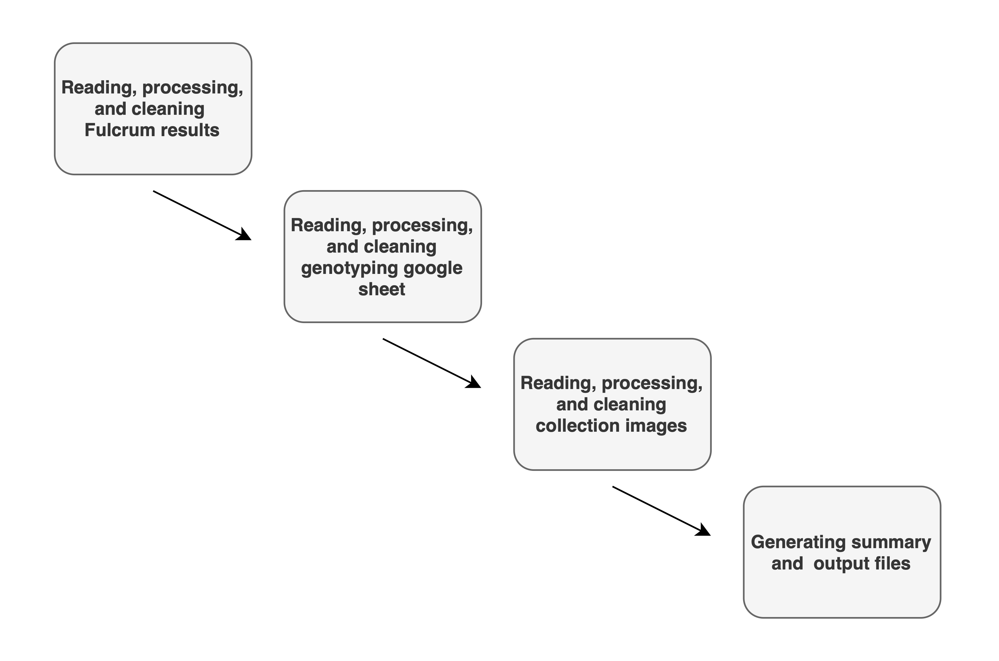

## Overview of easyfulcrum:

The **easyfulcrum** package is a tool to process and analyze ecological field sampling data generated using the Fulcrum mobile application.<br>

The **easyfulcrum** R package offers an organized workflow for processing ecological sampling data generated using the Fulcrum mobile application. **easyfulcrum** provides simple and efficient functions to clean, process, and visualize ecological field sampling and isolation data collected using custom Fulcrum applications. It also provides functions to join these data with genotype information if organisms isolated from the field are identified using molecular barcodes. Together, the Fulcrum mobile application and **easyfulcrum** R package allow researchers to easily implement mobile data-collection, cloud-based databases, and standardized data analysis tools to improve ecological sampling accuracy and efficiency.<br>

## Installing easyfulcrum:

Package installation depends on devtools 2.4.1 or later, and R 3.5.0 or later. Many packages on which easyFulcrum depends require development prerequisites on MacOS systems, including command line tools: (http://www.rstudio.com/ide/docs/packages/prerequisites). To use easyFulcrum’s procPhotos() function the imager package is required. This package has its own dependencies outside of R, which can be installed easily following the instructions provided on the package website (https://dahtah.github.io/imager/). 

```r
install.packages("devtools")
devtools::install_github("AndersenLab/easyfulcrum")
```

## Using easyfulcrum:

A general overview of the 14 main **easyfulcrum** functions is shown below.



The **easyfulcrum** vignette describes these functions and the features of the package in detail. This vignette of the package workflow with example data in the raw csv and jpg format is available online (http://andersenlab.org/easyfulcrum/articles/easyFulcrum.html)
